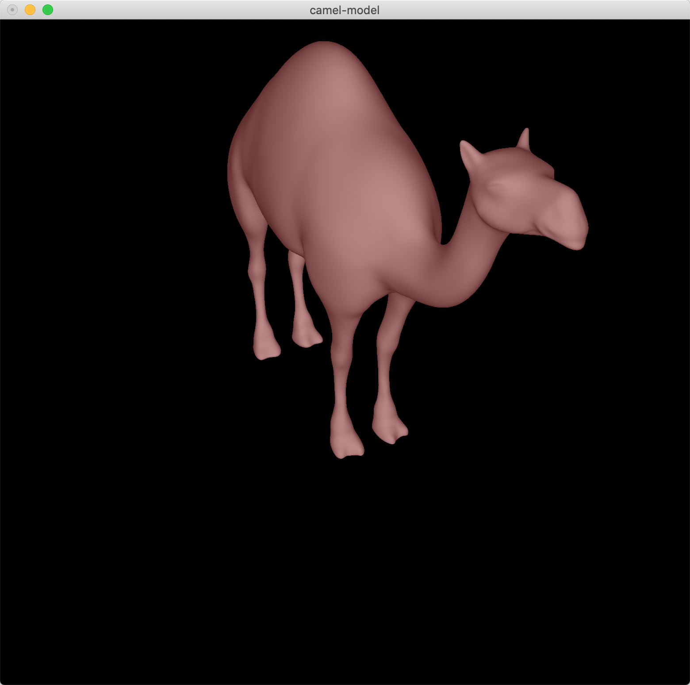

# 3D Modeling

###Basic
This project renders a camel model with the data read from **camel.obj** file.

###Operations
Some keyboard controllings are implemented to rotate or adjust view.

#####Effect

