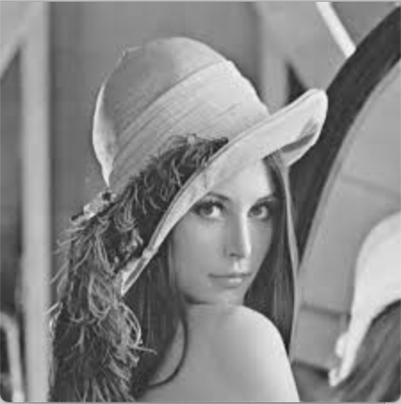
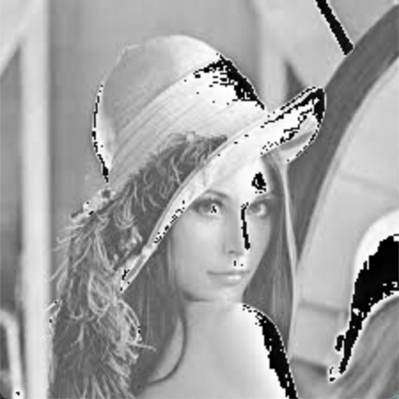
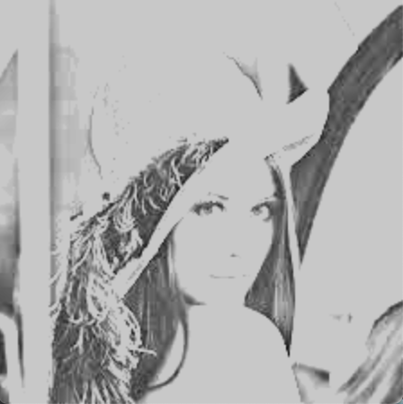
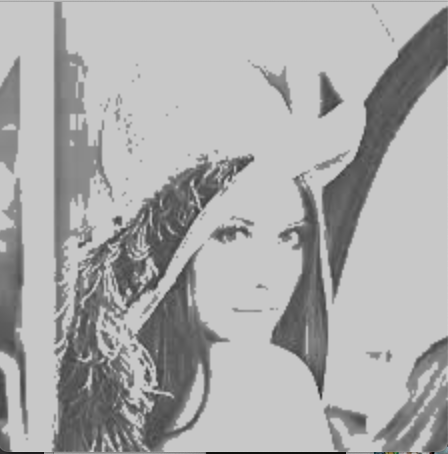
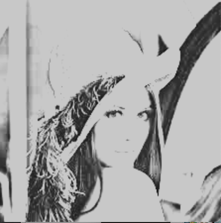
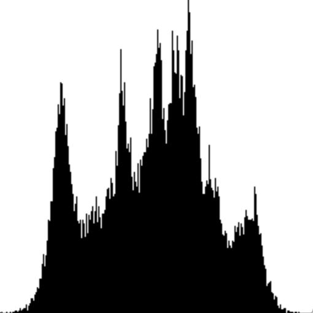

#Image Process

###Basic
This project implements fundamental **GrayScale** Transformation, including Linear and Contrast Stretching.

Also, Histogram and Histogram Equalization are displayed.

###Effect

#####Linear Transformation

1. k = 1, b = 10

2. k = 1, b = 30

3. k = 1, b = 50

#####Contrast Stretching Transformation

1. p1(10, 10) & p2(100, 200)

2. p1(10, 50) & p2(100, 200)

3. p1(50, 50) & p2(100, 200)

#####Histogram

#####Histogram Equalization

